# DLSSmc

DLSSmc is my personal project to add [DLSS](https://www.nvidia.com/en-us/geforce/technologies/dlss/) to Minecraft. Mojang has been putting in some good work to make Vulkan rendering another native option for Java outside of the traditional OpenGL, which is good for us because separation of concerns between rendering and game logic has never been better. I've been working with the new Vulkan renderpearl renderer in 26.3 Snapshot 3 via SpongePowered Mixin, with NVIDIA's [Streamline](https://developer.nvidia.com/rtx/streamline) SDK loaded directly through Java 25 FFM (Panama).

In my testing, the new Vulkan rendering is already at an awesome state, rendering 16+ chunks at 900+ FPS on a 4070 Super. Bad (and realistically expected) news is that NVIDIA's DLSS and the logic to piggyback it into Minecraft adds more per-frame latency than we benefit from in pure raster performance increase, notably dropping frames by 2x with DLSS turned on.

However! Hope is not lost. If you're running 900 FPS, what is the point of rendering 1.5x more? The goal is to help new shaders implementations (as well as raytracing) boost FPS. Historically, even with Sodium + Iris and various other optimization mods, Minecraft struggles hard with the beautiful shaders, extreme horizons, and insane texture packs that some folks like to run. For all you Vanilla lovers, this mod is probably not for you. But for you who love making the best game in the world also look the part, my goal is to help Minecraft run smoothly.

[](#license)
[](https://www.minecraft.net)
[](https://jdk.java.net/25/)
[](https://fabricmc.net)
[](https://github.com/lukeclaw/dlssmc/actions/workflows/build.yml)

---

## Features

| Feature | Status |
|---------|--------|
| DLSS Super Resolution | ✅ LIVE |
| DLSS Frame Generation | 🔄 Tuning |
| In-game tuning panel (K key) | ✅ LIVE |
| Benchmark suite (`/dlssmc bench`) | ✅ LIVE |

---

## Gallery

**Motion vector debug overlay** — depth-aware velocity pass visualized
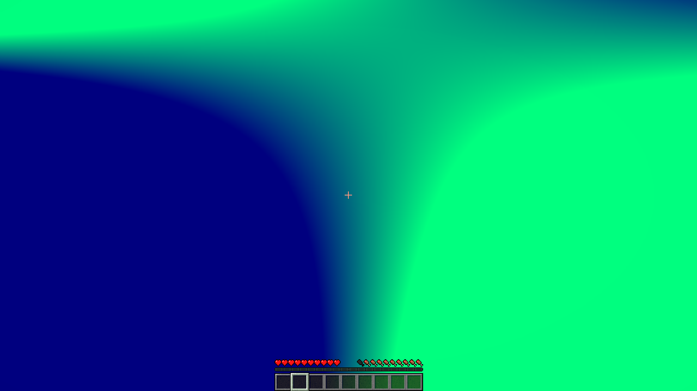

**Motion vectors overlaid on gameplay**
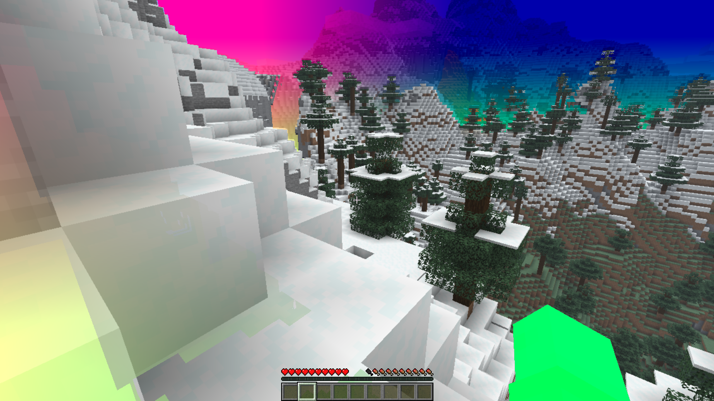

**Smearing artifact during debugging**
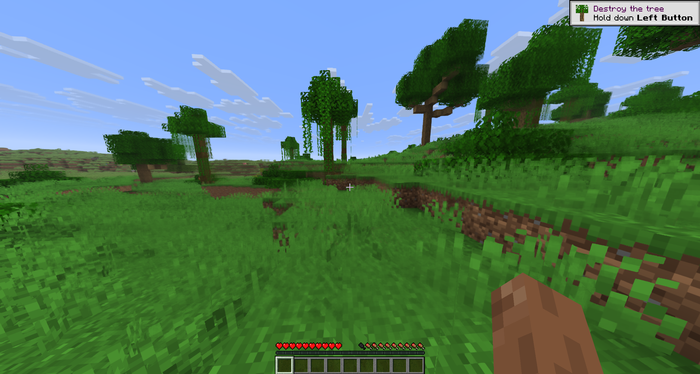

**Jitter sign comparison** — 200px center crops across 4 sign configurations
| (−,−) | (−,+) | (+,−) | (+,+) |
|:---:|:---:|:---:|:---:|
| 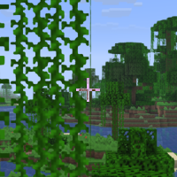 |  | 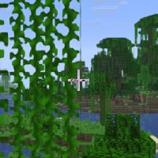 | 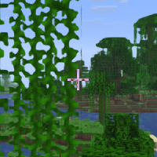 |

**Render scale comparison** — matching 300×200 crops (left, center, right) at 1.0, 0.667, and 0.5 scales

| Scale | Left | Center | Right |
|:---:|:---:|:---:|:---:|
| **1.0** | 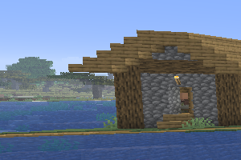 | 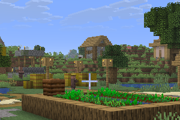 | 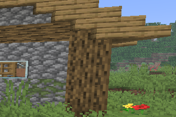 |
| **0.667** | 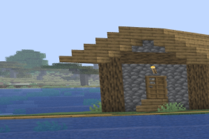 | 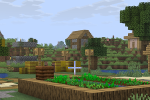 |  |
| **0.5** | 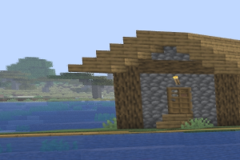 | 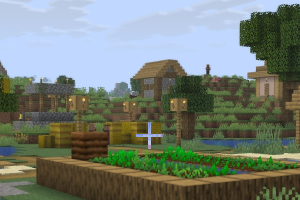 | 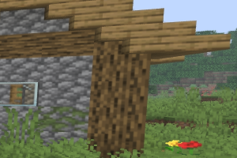 |

---

## Requirements

- **Minecraft:** Java Edition `26.3-snapshot-3` with the **Vulkan renderer** enabled
  (Video Settings → Graphics → **Prefer Vulkan (Experimental)**)
- **GPU:** NVIDIA RTX series with Vulkan 1.2+ driver
- **Java:** JDK 25
- **Mod loader:** Fabric Loader ≥0.19.3 + Fabric API
- **SDK:** NVIDIA Streamline SDK v2.12.0 (see [setup](#setup) below)

---

## Quick Start

### 1. Clone & build

```bash
./gradlew genSources   # decompile Minecraft sources (first time only)
./gradlew build        # build the mod
```

### 2. Set up Streamline SDK

DLSS requires NVIDIA's Streamline SDK, which is **not bundled** due to licensing. You'll need to:

1. Download [Streamline SDK v2.12.0](https://developer.nvidia.com/rtx/streamline) from NVIDIA
2. Extract it to `streamline-sdk-v2.12.0/` in the project root
3. The build expects the following files under that directory:
   - `bin/x64/sl.interposer.dll`
   - `bin/x64/nvngx_dlss.dll`
   - `bin/x64/nvngx_dlssg.dll`
   - `bin/x64/sl.reflex.dll`

### 3. Run

```bash
./gradlew runClient
```

In-game: ensure **Prefer Vulkan** is ON, then press **K** to open the tuning panel
or use the commands below.

---

## Commands

| Command | Description |
|---------|-------------|
| `/dlssmc dlss` | Toggle DLSS Super Resolution on/off |
| `/dlssmc fg` | Toggle DLSS Frame Generation on/off |
| `/dlssmc sl` | Show Streamline SDK status |
| `/dlssmc mv` | Toggle motion vector debug overlay |
| `/dlssmc scale` | Cycle render scale (Native → 0.667 → 0.5) |
| `/dlssmc mode` | Cycle DLSS mode (Auto, MaxPerf, Balanced, MaxQuality, DLAA) |
| `/dlssmc preset` | Cycle DLSS preset override (Default, K, L, M) |
| `/dlssmc bias` | Cycle mip LOD bias offset |
| `/dlssmc mvx` / `/dlssmc mvy` | Flip motion vector sign X/Y |
| `/dlssmc jx` / `/dlssmc jy` | Flip jitter sign X/Y |
| `/dlssmc bench` | Start/stop benchmark run |

> **K key** — Opens the non-pausing DLSSmc tuning panel for quick A/B comparison.

---

## Architecture

```
┌─────────────────────────────────────────────────────────────┐
│                     Minecraft (renderpearl)                  │
│  ┌──────────────┐   ┌──────────────┐   ┌─────────────────┐ │
│  │ GameRenderer  │   │ LevelRenderer│   │  VulkanBackend   │ │
│  │ (jitter/res)  │   │ (MV pass,    │   │  (vkCreate*)     │ │
│  │               │   │  DLSS eval)  │   │                  │ │
│  └──────┬───────┘   └──────┬───────┘   └────────┬────────┘ │
│         │                  │                     │          │
│         ▼                  ▼                     ▼          │
│  ┌─────────────────────────────────────────────────────┐   │
│  │              Mixin Injection Layer                    │   │
│  │  GameRendererMixin  LevelRendererMixin  Vulkan*Mixin │   │
│  └──────────────────────┬──────────────────────────────┘   │
│                         │                                   │
└─────────────────────────┼───────────────────────────────────┘
                          │
          ┌───────────────┼───────────────┐
          ▼               ▼               ▼
┌──────────────┐  ┌──────────────┐  ┌──────────────┐
│  SlBridge     │  │  DlssJitter  │  │ DlssEvaluator│
│ (FFM Panama   │  │  Halton(2,3) │  │ (per-frame   │
│  → sl.inter-  │  │  sequence    │  │  SL pipeline)│
│  poser.dll)   │  │              │  │              │
└──────┬───────┘  └──────────────┘  └──────┬───────┘
       │                                    │
       ▼                                    ▼
┌──────────────────────────────────────────────────────────┐
│              NVIDIA Streamline SDK (sl.interposer.dll)     │
│  ┌──────────┐  ┌──────────┐  ┌──────────┐  ┌──────────┐ │
│  │ DLSS-SR  │  │ DLSS-FG  │  │  Reflex  │  │   PCL    │ │
│  └──────────┘  └──────────┘  └──────────┘  └──────────┘ │
└──────────────────────────────────────────────────────────┘
```

### Key components

| Component | File | Role |
|-----------|------|------|
| **SlBridge** | `src/client/.../dlss/SlBridge.java` | Java 25 FFM (Panama) binding — loads `sl.interposer.dll` directly, no JNI |
| **DlssEvaluator** | `src/client/.../dlss/DlssEvaluator.java` | Per-frame DLSS pipeline: token → constants → tag resources → `slEvaluateFeature` |
| **DlssJitter** | `src/client/.../dlss/DlssJitter.java` | Halton(2,3) sub-pixel jitter sequence for temporal feedback |
| **DlssMotion** | `src/client/.../dlss/DlssMotion.java` | Camera state tracking + reprojection matrix math |
| **DlssVelocity** | `src/client/.../dlss/DlssVelocity.java` | Fullscreen depth-aware velocity pass (RG16F motion vectors) |
| **DlssResolution** | `src/client/.../dlss/DlssResolution.java` | Resolution decoupling — world at internal scale, HUD at native |
| **DlssMipBias** | `src/client/.../dlss/DlssMipBias.java` | Automatic mip LOD bias correction for reduced render scales |
| **DlssBenchmark** | `src/client/.../dlss/DlssBenchmark.java` | Automated benchmark suite |
| **DlssTuningScreen** | `src/client/.../DlssTuningScreen.java` | In-game tuning panel (K key) |

---

## Project Structure

```
├── src/
│   ├── main/                         # Common mod code
│   │   ├── java/com/jhp/
│   │   │   ├── DLSSmc.java           # Mod entrypoint
│   │   │   └── mixin/ExampleMixin.java
│   │   └── resources/
│   ├── client/                       # Client-side code
│   │   ├── java/com/jhp/client/
│   │   │   ├── DLSSmcClient.java     # Client init + commands
│   │   │   ├── DlssTuningScreen.java # In-game tuning panel
│   │   │   ├── dlss/                 # DLSS core engine
│   │   │   │   ├── SlBridge.java     # FFM → Streamline bridge
│   │   │   │   ├── DlssEvaluator.java
│   │   │   │   ├── DlssJitter.java
│   │   │   │   ├── DlssMotion.java
│   │   │   │   ├── DlssVelocity.java
│   │   │   │   ├── DlssResolution.java
│   │   │   │   ├── DlssMipBias.java
│   │   │   │   ├── DlssRenderState.java
│   │   │   │   ├── DlssDebug.java
│   │   │   │   ├── DlssBenchmark.java
│   │   │   │   └── DlssTargetAccess.java
│   │   │   └── mixin/                # Mixin injection targets
│   │   │       ├── VulkanInstanceMixin.java
│   │   │       ├── VulkanBackendMixin.java
│   │   │       ├── VulkanDeviceMixin.java
│   │   │       ├── VulkanGpuSurfaceMixin.java
│   │   │       ├── VulkanGpuSamplerMixin.java
│   │   │       ├── GameRendererMixin.java
│   │   │       ├── LevelRendererMixin.java
│   │   │       └── MinecraftMixin.java
│   │   └── resources/
│   │       ├── assets/dlssmc/
│   │       │   ├── lang/en_us.json
│   │       │   └── shaders/core/
│   │       │       ├── dlss_velocity.fsh
│   │       │       ├── dlss_velocity_debug.fsh
│   │       │       └── dlss_depth_debug.fsh
│   │       └── dlssmc.client.mixins.json
│   └── main/resources/
│       ├── assets/dlssmc/icon.png
│       ├── fabric.mod.json
│       └── dlssmc.mixins.json
├── docs/                            # Documentation
│   ├── PRD.md                       # Product requirements
│   ├── PROJECT_TRACKER.md           # Live status & task tracker
│   ├── IMPLEMENTATION_GUIDE.md      # Architecture & implementation spec
│   ├── FRAMEGEN_BRIEF.md            # DLSS Frame Generation spec
│   ├── SPIKE_FINDINGS.md            # Research findings
│   ├── PERFORMANCE.md               # Performance analysis
│   ├── LICENSE_NOTES.md             # NVIDIA license analysis
│   ├── VERIFY.md                    # Build/test iteration guide
│   └── architecture_sequence.puml   # UML architecture sequence diagram
├── gradle/                          # Gradle wrapper
├── build.gradle                     # Build configuration
├── settings.gradle
├── gradle.properties
├── .github/workflows/build.yml     # CI
└── LICENSE                          # CC0-1.0
```

---

## Documentation

The [`docs/`](./docs/) directory contains detailed engineering documentation:

- [Project Tracker](./docs/PROJECT_TRACKER.md) — live status, task tracker, decision log
- [PRD](./docs/PRD.md) — product requirements & scope
- [Implementation Guide](./docs/IMPLEMENTATION_GUIDE.md) — architecture, file map, gotchas
- [Frame Generation Brief](./docs/FRAMEGEN_BRIEF.md) — DLSS-G implementation spec
- [Spike Findings](./docs/SPIKE_FINDINGS.md) — research & empirical evidence
- [Performance](./docs/PERFORMANCE.md) — performance analysis & optimization notes
- [License Notes](./docs/LICENSE_NOTES.md) — NVIDIA Streamline/DLSS license review
- [Verify Guide](./docs/VERIFY.md) — build/test iteration loop

---

## License

- **Mod source code:** [CC0 1.0 Universal](./LICENSE) (public domain)
- **NVIDIA Streamline SDK & DLSS binaries:** NVIDIA proprietary SDK license — see
  [`docs/LICENSE_NOTES.md`](./docs/LICENSE_NOTES.md) and the Streamline SDK's own
  license before redistributing.

---

*Built with [Fabric Loom](https://fabricmc.net/wiki/documentation:fabric_loom),
[SpongePowered Mixin](https://github.com/SpongePowered/Mixin), and
[NVIDIA Streamline](https://developer.nvidia.com/rtx/streamline).*
